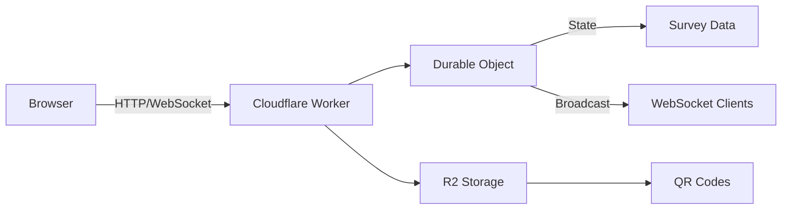

# Real-time Voting App

[](https://deploy.workers.cloudflare.com/?url=https://github.com/erichayth/realtime-voting-app)
[](https://opensource.org/licenses/MIT)
[](https://workers.cloudflare.com)
[](https://www.typescriptlang.org/)

A blazing-fast, real-time voting application built with Cloudflare Workers, Durable Objects, and WebSockets. Perfect for live presentations, workshops, and interactive demos.

## 🎯 Demo

Deploy your own instance using the button above to try it live!


## ✨ Features

- 🗳️ **Multi-select voting** - Participants can choose multiple options
- ⚡ **Real-time updates** - Live vote tallies using WebSockets
- 📱 **QR code generation** - Easy mobile access via QR codes stored in R2
- 🚫 **Duplicate prevention** - Session-based voting prevention
- 📊 **Live results** - Beautiful, animated results display
- 🔄 **Easy reset** - Quick survey reset between sessions
- 📱 **Mobile-first** - Responsive design that works on all devices
- 🌍 **Global edge deployment** - Low latency worldwide via Cloudflare's network

## 🚀 Quick Deploy

### Option 1: Deploy with Cloudflare Deploy Button (Recommended)

[](https://deploy.workers.cloudflare.com/?url=https://github.com/erichayth/realtime-voting-app)

Click the button above to deploy directly to Cloudflare Workers!

### Option 2: Manual Deployment

1. **Clone the repository**:
   ```bash
   git clone https://github.com/erichayth/realtime-voting-app.git
   cd realtime-voting-app
   npm install
   ```

2. **Configure Wrangler**:
   ```bash
   cp wrangler.example.jsonc wrangler.jsonc
   # Edit wrangler.jsonc with your settings
   ```

3. **Set up environment**:
   ```bash
   cp .env.example .env
   # Edit .env with your Cloudflare account ID and settings
   ```

4. **Create R2 bucket**:
   ```bash
   npx wrangler r2 bucket create survey-qr-codes
   ```

5. **Deploy to Cloudflare**:
   ```bash
   npx wrangler deploy
   ```

## 📖 Usage

### For Participants

1. **Access the voting page** via URL or QR code
2. **Select your choices** (multi-select supported)
3. **Submit your vote** - One vote per session
4. **Watch results update** in real-time

### For Presenters

1. **Display QR code**: `https://your-worker.workers.dev/qr`
2. **Show live results**: `https://your-worker.workers.dev/results`
3. **Reset between sessions**:
   ```bash
   curl -X POST \
     -H "Authorization: Bearer YOUR_PASSWORD" \
     https://your-worker.workers.dev/api/reset
   ```

## 🛠️ Configuration

### Customize Survey Options

Edit the `AI_TOOLS` array in `src/index.ts`:

```typescript
const AI_TOOLS = [
  "Claude Code",
  "Replit",
  "Cursor",
  "Windsurf",
  // Add your options here
];
```

### Environment Variables

Set in `wrangler.jsonc`:

```json
{
  "vars": {
    "RESET_PASSWORD": "your-secure-password"
  }
}
```

### Custom Domain

Add to `wrangler.jsonc`:

```json
{
  "routes": [
    {
      "pattern": "vote.yourdomain.com",
      "custom_domain": true
    }
  ]
}
```

## 🏗️ Architecture



### Technology Stack

- **[Cloudflare Workers](https://workers.cloudflare.com)** - Edge compute platform
- **[Durable Objects](https://developers.cloudflare.com/workers/learning/using-durable-objects/)** - Stateful, single-instance compute
- **[WebSockets](https://developers.cloudflare.com/workers/learning/using-websockets/)** - Real-time bidirectional communication
- **[R2 Storage](https://developers.cloudflare.com/r2/)** - Object storage for assets
- **[Workers Sites](https://developers.cloudflare.com/workers/platform/sites/)** - Static asset serving
- **TypeScript** - Type-safe development

## 🧑‍💻 Development

### Local Development

```bash
# Start local dev server
npx wrangler dev

# View logs
npx wrangler tail

# Run vote simulator for testing
node simulate-votes.js
```

### Project Structure

```
realtime-voting-app/
├── src/
│   └── index.ts          # Main Worker & Durable Object
├── public/
│   ├── index.html        # Voting interface
│   ├── results.html      # Results display
│   └── results-styles.css # Styles
├── wrangler.jsonc        # Worker configuration
├── package.json          # Dependencies
└── simulate-votes.js     # Testing utility
```

### Key Files

- **`src/index.ts`** - Core application logic
- **`public/index.html`** - Voting interface
- **`public/results.html`** - Live results display
- **`wrangler.jsonc`** - Cloudflare Workers configuration

## 📊 Performance

- **Cold start**: < 10ms
- **WebSocket latency**: < 50ms global average
- **Concurrent connections**: 100+ per Durable Object
- **Global availability**: 200+ edge locations

## 🔒 Security

- Session-based duplicate prevention
- Password-protected admin endpoints
- CORS protection
- No personal data collection
- Secure WebSocket connections

## 🤝 Contributing

We welcome contributions! Please see our [Contributing Guide](CONTRIBUTING.md) for details.

### Quick Contribution Guide

1. Fork the repository
2. Create a feature branch (`git checkout -b feature/amazing-feature`)
3. Commit your changes (`git commit -m 'Add amazing feature'`)
4. Push to the branch (`git push origin feature/amazing-feature`)
5. Open a Pull Request

## 📝 License

This project is licensed under the MIT License - see the [LICENSE](LICENSE) file for details.

## 🙏 Acknowledgments

- Built with [Cloudflare Workers](https://workers.cloudflare.com)
- Inspired by real-time collaboration needs
- Community feedback and contributions

## 📧 Support

- **Issues**: [GitHub Issues](https://github.com/erichayth/realtime-voting-app/issues)
- **Discussions**: [GitHub Discussions](https://github.com/erichayth/realtime-voting-app/discussions)

## 🚀 Roadmap

- [ ] Multiple concurrent surveys
- [ ] Custom branding options
- [ ] Advanced analytics dashboard
- [ ] Export functionality (CSV/JSON)
- [ ] Time-based voting windows
- [ ] Authentication support
- [ ] Webhooks for vote events
- [ ] GraphQL API

---

**Built with ❤️ using [Cloudflare Workers](https://workers.cloudflare.com)**